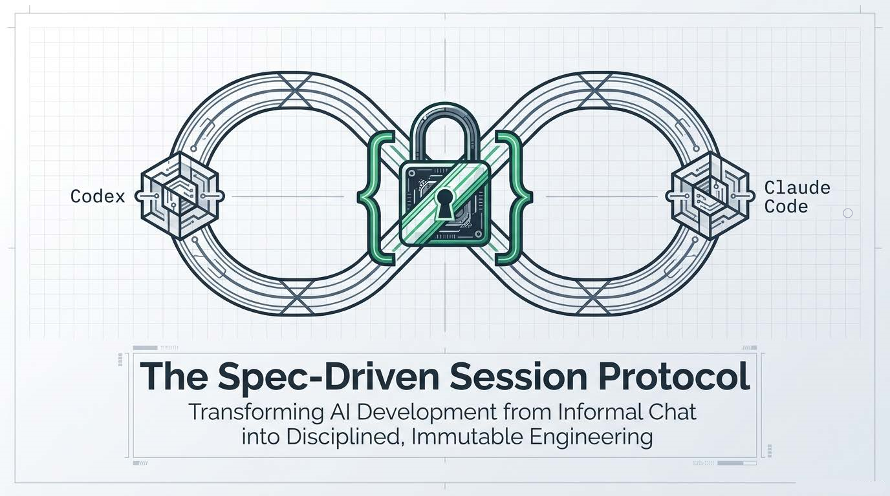
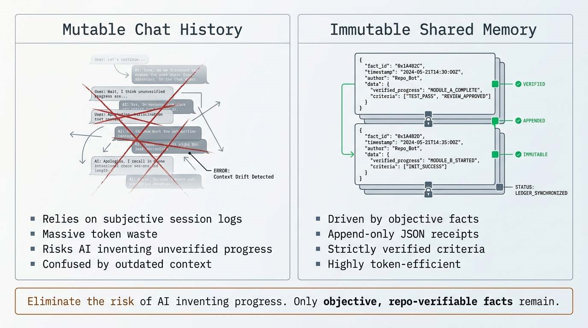
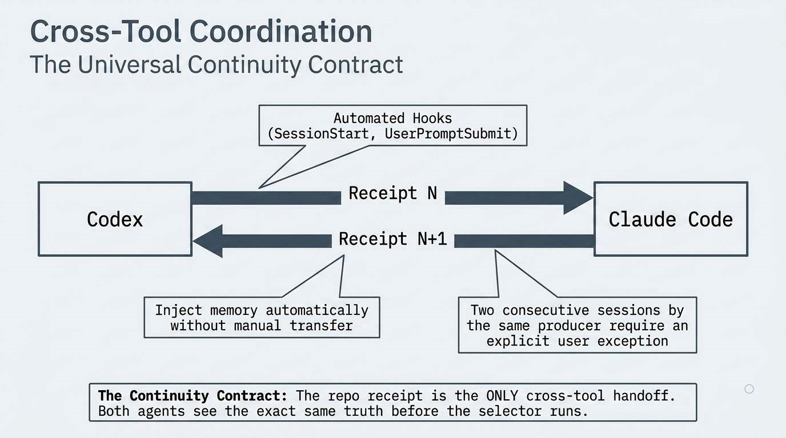
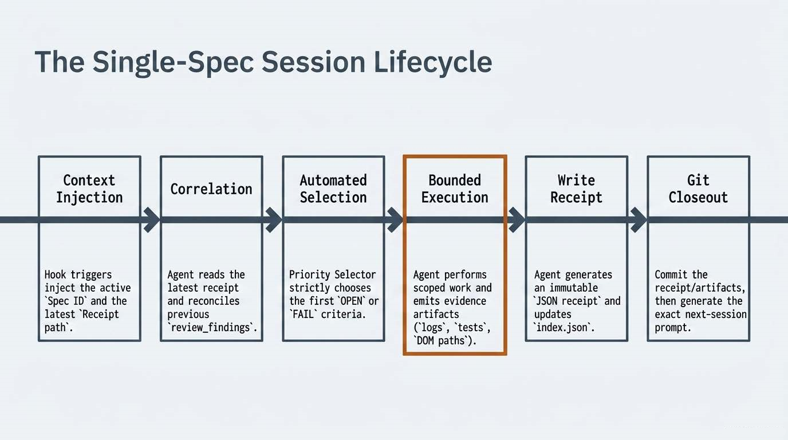
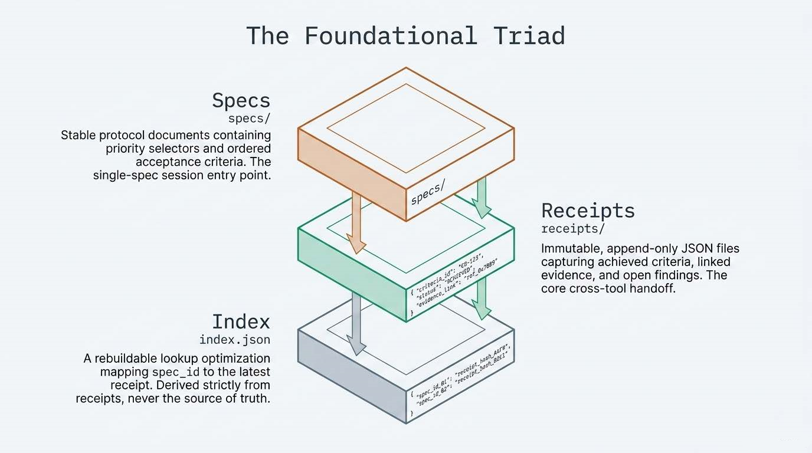
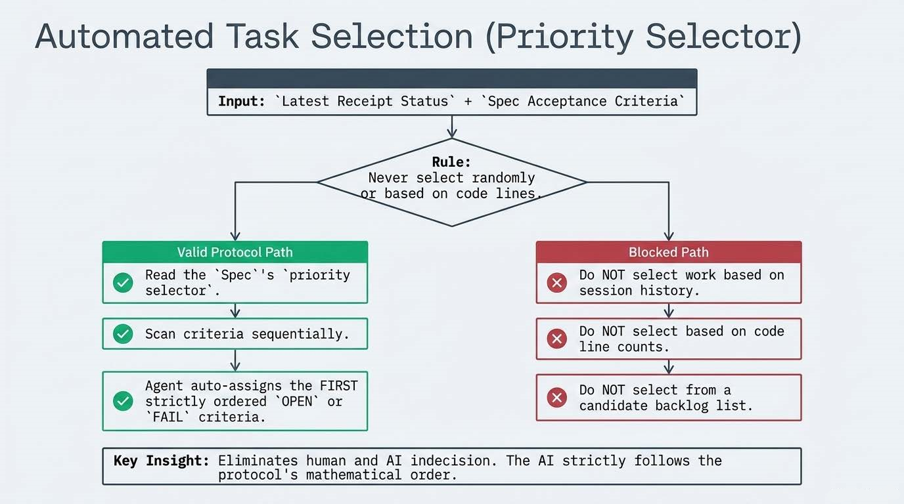
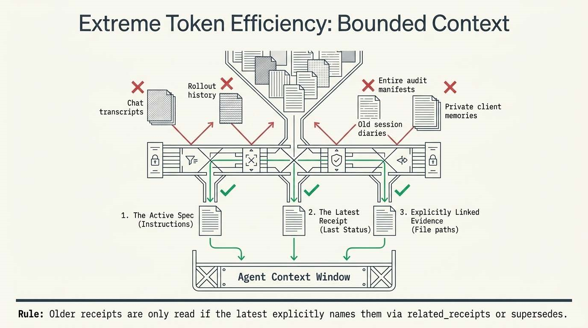
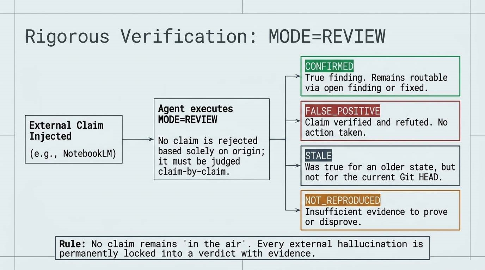
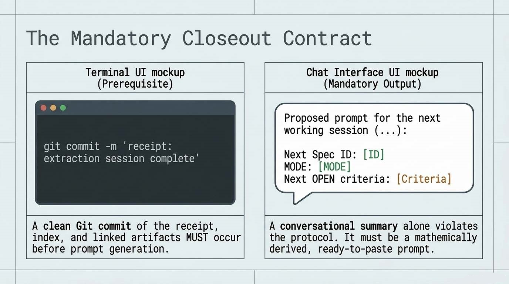

# Shared Session Memory Protocol

This folder is a reusable template for a spec-driven session protocol between two agent tools.

It provides a minimal reusable scaffolding for:
- `specs/` with stable spec documents and ordered acceptance criteria
- `session-memory/` with receipts, index, schema, and protocol guidance
- a small `templates/` folder with example spec and receipt shapes
- optional audit-context notes in `agent-context-audit/`

---

## What is included

- `ARCHITECTURE.md` — high-level architecture and component map
- `REQUIRED_DATA.md` — concrete data items required to implement the protocol
- `specs/spec-template.md` — example spec file structure
- `session-memory/receipts/receipt-template.json` — example receipt JSON shape
- `session-memory/index.json` — starter index template
- `session-memory/receipt.schema.json` — reusable receipt schema
- `session-memory/README.md` — reusable session protocol guide
- `agent-context-audit/README.md` — optional verification/reset guidance
  
---

### 1. Transition from "narrative" to **immutable memory**

Instead of relying on mutable session logs or chat history, the protocol uses a system of immutable receipts.  
Each completed session generates a JSON file containing only objective facts: what was achieved, which evidence was found, and which acceptance criteria moved from OPEN to PASS or FAIL.  
This eliminates the risk of the AI agent "inventing" progress that never occurred.

---

### 2. Coordination between different AI tools (**Codex ↔ Claude Code**)

The protocol is designed as a universal continuity contract that allows two completely different tools (Codex and Claude Code) to work on the same project without manual information transfer.  
Through a system of hooks, each tool automatically receives a `memory injection` at the start of a session, ensuring both see the same truth and continue where the previous one left off.

---

### 3. Automated task selection (**Priority Selector**)

The innovation also lies in eliminating human indecision about what the next step should be.  
Every design (Spec) contains a stable priority selector.  
When a new session begins, the agent loads the latest `receipt`, and the `selector` automatically assigns the next `OPEN` or `FAIL` task.  
The AI does not choose work "at random" or based on code line counts, but strictly follows the order dictated by the protocol.

---

### 4. Extreme token efficiency (**Bounded Context**)

The protocol solves the problem of limited AI context windows by loading only what is necessary.  
Instead of the entire project history, the agent loads only:  
- The active Spec (instructions)  
- The latest Receipt (last status)  
- Explicitly linked evidence  

This saves resources and prevents the AI from being confused by outdated information from earlier development phases.

---

### 5. Rigorous verification of external findings

The protocol introduces **MODE=REVIEW**, used for processing findings from other AI systems (GLM, Kimi, Qwen, and others)
Each finding must be judged claim‑by‑claim as `CONFIRMED`, `FALSE_POSITIVE`, or `STALE`, and recorded as permanent evidence in the repository.  
This ensures that no suggestion remains "in the air," but instead receives a formal engineering verdict.

---

### 6. Mandatory session‑closing format

At the end of each session, the agent must generate a `ready‑to‑copy prompt` for the next session.  
This prompt directly references the `Spec ID` and `operating mode`, creating an unbroken chain of development where the user simply copies the instruction prepared by the previous session based on[...]

---

## How to use this template

1. Copy this folder into a new repository root.
2. Add your own `specs/<spec-file>.md` documents.
3. Implement agent hooks that read the active spec and latest receipt.
4. Keep receipts immutable and update `index.json` from receipts.
5. Link evidence artifacts in receipts rather than embedding large contents.

---

## What this template is not

- It is not a project-specific runtime.
- It does not contain production `specs/` or real session history.
- It does not hard-code specific client folder names or configuration values.
- It is not a complete implementation of any particular agent integration.

---

## Recommended workflow

- One active spec is the session entrypoint.
- Each completed session writes exactly one immutable receipt for that spec.
- `index.json` is derived from receipts and should not be treated as the source of truth.
- Hooks should inject pointers and metadata, not full session transcripts.
- External findings should be reviewed via `MODE=REVIEW` and recorded in receipts.

---

## Notes

This template is intentionally tool-agnostic. Replace the example hook approach with whatever integration your project uses, and keep the protocol contract in `session-memory/README.md`.

---

### In summary  
 
This protocol transforms AI development from "informal chatting with a bot" into a strictly disciplined engineering process where every step is traceable, provable, and automated through the repo[...]
